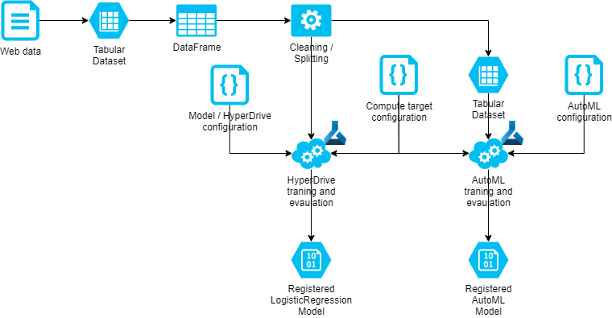
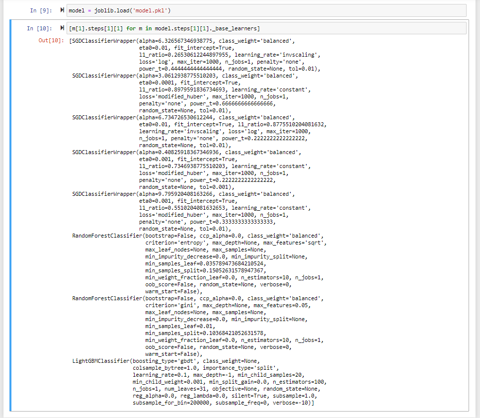

# Optimizing an ML Pipeline in Azure

## Overview
This project is part of the Udacity Azure ML Nanodegree.
In this project, we build and optimize an Azure ML pipeline using the Python SDK and a provided Scikit-learn model.
This model is then compared to an Azure AutoML run.

## Summary
This dataset contains data about bank marketing calls. We seek to predict whether a call will result in a successful term loan subscription.

The best performing model was an SGDClassifier model (basically a logistic regression model trained using a stochastic gradient descent solver), pipelined with a StandardScaler preprocessing step.

## Pipeline architecture

## HyperDrive optimization

### Parameter Sampler
I set the parameter sampler to explore both `lbfgs` and `saga` solver algorithms, with `l1` and `l2` penalty regularizatiion, as well as exploring the regularization strength parameter `C`. I also set the sampler to sample from a logarithmic space for `C` as nature of the inverse of the regularization strength is logarithmic. This allowed HyperDrive to search the space for `C` more efficiently, while additionally checking whether the regularization penalty as well as the solver algorithm itself have any significant effect on the model performance. I used a random sampler so that as much of the space could be explored in a short time to gain insight into the distribution across the parameter space.

### Early Stopping Policy
Due to time constraints I needed an early stopping policy that would terminate low performing runs sooner than later. The Bandit policy with a 20% slack ratio terminates runs if the primary metric does not match the best run so far within 20%. Assume we use accuracy as the primary metric. This dataset has a large class imbalance such that a majority-class classifier would achieve an 88.8% accuracy. Assume at least one run achieves an accuracy of 88.8%; setting the slack ratio to 20% and evaluation iterations to 10 means that any subsequent run that fails to achieve at least a 74% accuracy by the 10th iteration will be terminated. This is a reasonable expectation for this classification problem therefore this policy is appropriate.

### HyperDrive Results
HyperDrive optimization revealed that althrough saga is a faster algorithm, lbfgs appeared to perform better, with l2 regularization (lbfgs does not support l1 regularization). Also a low value for C (i.e. strong regularization) produced better models.

## AutoML
A stacked ensemble model was the best model identified by the AutoML run, achieving a normalized macro recall score of 0.76 in comparison to the 0.38 achieved by the HyperDrive-optimized LogisticRegression model. The ensemble model consisted of five [SGDClassifiers](https://scikit-learn.org/stable/modules/generated/sklearn.linear_model.SGDClassifier.html), two [RandomForestClassifiers](https://scikit-learn.org/stable/modules/generated/sklearn.ensemble.RandomForestClassifier.html) and one [LightGBMClassifier]() model.

#### SGDClassifier hyperparameters
It was interesting to note that none of the SGDClassifier models used the default `optimal` learning rate, instead opting for `constant` or `invscaling` and used a variety of `eta` (initial learning rate) values. The choice for `loss` makes sense as it is a logistic regression problem therefore `log` or `modified_huber` are more appropriate than the default `hinge` value. The `alpha` multiplier is much higher than I expected, since the default is 0.0001 which seems to suggest that stronger regularization yields a better model. That in itself may suggest that some re-evaluation of the dataset may be appropriate as the data may include collinear features that are resulting in a tendency to overfit. The `power_t` value is in line with the default value of 0.5 where used (only needed when `loss`=`invscaling`).

#### RandomForestClassifier
The approach taken with the RandomForestClassifiers was to have just a few trees, with `n_estimators` set to just 10 where the default is 100, and also with one using `n_features`=`sqrt` (i.e. sqrt(features) being the maximum number of features used in the tree) and the other using just 5% of the features. It appears that this may be a really good way to identify features that have a significant effect on the model and it may be interesting to review the feature importances of these models.

#### LightGBMClassifier
The LightGBMClassifier used all the default hyperparameters

## Pipeline comparison
First and of significant impact is the preprocessor. The application of the scaling to all the features that had not been addressed by the cleaning script provided in the project template has a very large impact on the model's ability to learn from the feature space. Logistic regression models perform significantly better with inputs that are scaled to the same range and better when they have similar distributions.

Second the SGDClassifier is basically a LogisticRegression model but trained using a stochastic gradient descent algorithm, which facilitates finding the minimum point of the loss function when dealing with larger feature spaces.

Both of these characteristics combine to make the AutoML model superior to the optimized LogisticRegression model. If the LogisticRegression class in scikit-learn implemented the SGD solver, and more effort was given to data cleaning, I believe the HyperDrive output may have been more comparable to the AutoML result, however the AutoML result did indeed validate that a LogisticRegression model is appropriate for the task.

## Improvements
1. More attention could be given to the dataset cleaning process. There are many variables in the model that can be cleaned more diligently, for example call duration is not known at the start of a call therefore should not be part of a model that is intended to predict the outcome of the call. The 'month' feature should also be discarded as data is over multiple years and socioeconomic features correlate with month. This repository also includes a supplementary script file (`cleaner.py`) with an improved data cleaning routine. A model trained on this data achieved a `norm_macro_recall` of 0.49, compared to the 0.38 achieved using HyperDrive optimization.
1. Low feature coefficients correspond to features that have very weak influence on the outcome. Removing these features from the model will make the model smaller and faster to calculate predictions and faster to retrain if the need arises. It also makes it cheaper in terms of effort to calculate and collate the respective inputs for each prediction.

## Other future work
1. Analysis of the feature influences on the outcome will yield insights into the marketing practices of this bank and may assist to refine call targets. For example while the education and employment features weigh strongly on the outcome, the socioeconomic factors are actually very strong influencers so in an uncertain market the bank may look to focusing efforts on a subset of their target population to maximize uptake of loan offers.
1. Analysis of feature influences will also yield insights into marketing practice fairness and equity. While the ratio of term loan subscription among literate people ranges between 7% and 15%, the subscription ratio among illiterate people is 26% (although the sample size is small: just 15 individuals in the dataset). This could be indicative of predatory lending practices at this bank which if not catered for in the model, may exacerbate the practice if the model indicates that illiterate people are a prime target for such loan offers.
1. A model trained on this data could be used in two ways: While an obvious use case would be to predict the outcome of a call prior to the call being made, another use case may be in marketing data auditing, to check whether the data collected by the marketing department 'fits' this model. Anomalies in any feature may be indicative of erroneous data, which could be a result of customer drift, system errors and corrupted data, or fraud.

## Proof of cluster clean up
Completed in code.

## Rubric
[Link](https://review.udacity.com/#!/rubrics/2925/view)